Last updated: August 12, 2022  
Author: Nivedita Vatsa

## Running R Scripts on Fargate

This post describes the steps for running R scripts by deploying a Docker container using ECS Fargate.  The end result will be an ECS Fargate cluster that runs user-specified R scripts (identified by name and S3 bucket location) and capture the output (in an S3 bucket) and logs (AWS Cloudwatch).

Some tools and AWS services covered include:
+ R
+ Docker
+ AWS Identity and Access Management (IAM)
+ AWS Simple Storage Service (S3)
+ AWS Elastic Container Registry (ECR)
+ AWS Elastic Container Service (ECS) Fargate
+ AWS Cloudwatch 


At a high level, the steps described in this post are as follows:

1. [Write an R script for testing purposes](#1-write-an-r-script-for-testing-purposes)
2. [Upload the R script (and other materials) to an S3 bucket](#2-upload-the-r-script-to-an-s3-bucket)
3. [Write a Dockerfile to run R](#3-write-a-dockerfile-to-run-r)
4. [Test the Docker container locally](#4-test-the-docker-container-locally)
5. [Push the container image to to ECR](#5-push-the-container-image-to-to-ecr)
6. [Set up the appropriate IAM permissions between AWS services](#6-set-up-the-appropriate-iam-permissions-between-aws-services)
    * 6a. [Create a policy for S3 access](#6a-create-a-policy-for-s3-access)
    * 6b. [Create a policy for ECR access; attach to user](#6b-create-a-policy-for-ecr-access-attach-to-user)
    * 6c. [Create a Task Role](#6c-create-a-task-role)
    * 6d. [Attach ECS Access Policy to a user](#6d-attach-ecs-access-policy-to-a-user)
    
7. [Create an ECS Fargate cluster](#7-create-an-ecs-fargate-cluster)
8. [Create a Task Definition within the Fargate cluster](#8-create-a-task-definition-within-the-fargate-cluster)
9. [Run individual tasks](#9-run-individual-tasks)
10. [View logs & S3 bucket](#10-view-logs--s3-bucket)
11. [Concluding thoughts](#11-concluding-thoughts)
    * 11a. [Next steps](#11a-next-steps)
    * 11b. [Outstanding issues and questions](#11b-outstanding-issues-and-questions)
    * 11c. [Helpful resources](#11c-helpful-resources)

More detailed instructions are provided below:

### **1. Write an R script for testing purposes**

Write an R script that imports a data file and produces an output file.  For the purposes of this exercise, I wrote `test-script.R`.  This file:
+ Reads in a file called `input.txt`, appends some text to this file, and exports it as a `output1a.txt`.
+ Generates a made-up dataframe, converts it to `tibble` format, and exports it as `output1b.csv`.
+ Includes several print statements.  These statements will eventually appear in the Fargate logs.

Notice that t `tibble` package is called within `test-script.R`.  To ensure that the Docker container has this package (discussed further below), I wrote a second R script that contains commands for installing all necessary packages.  This file is called `requirements.R`.  For this example, it installs only the `tibble` package, but we can install more packages within this script if needed.

**(Optional)** Feel free to skip this step and return after you have run your first Fargate task. I created a second test script which will be useful once we're running multiple tasks within Fargate.  This script (`test-script-2.R`) is very similar to `test-script.R`, but with different print statements and different names for output files `output2a.txt` and `output2b.csv`.  


### **2. Upload the R script to an S3 bucket**
Create an S3 bucket and place your scripts (`test-script.R` and `requirements.R`) within a folder.  I saved these files to a folder ending with `r_scripts/`.  Also upload any script inputs to the S3 bucket.  I saved my input file (`input.txt`) to the main directory.  Create a separate folder for output files.  For this example, this folder is saved in the same locaation, but ends with `output/`.

The location of R scripts and the desired location of the outputs will be relevant for building the Docker image.  The exact folder structure I used is provided below:
```
root
│   input.txt    
│
└───r_scripts
│   │   requirements.R
│   │   test-script.R
│   │   test-script-2.R (optional)
│   
└───output
    │   <empty>
```
You do not need to follow this organization exactly.  Any organization should work as long as the S3 bucket and Docker container are consistent (discusssed further below).


### **3. Write a Dockerfile to run R**
In this section, we discuss the process of writing instructions to a Dockerfile.  As a prerequisite, ensure that you have Docker already installed.

In the simple terms, the Dockerfile has a instructions for building a container.  These instructions allow us to install R, R packages, and AWS CLI.  They also allow us to add our input files and R scripts to the container.  Below is a step-by-step walkthrough of the Dockerfile:

The full Dockerfile is saved [here](Dockerfile) and a line-by-line breakdown is provided below:

+ Step 1:  Install R.  [The Rocker Project](https://rocker-project.org/images/) provides a collection of Docker images that can serve as a foundation upon which we can build a custom R environment.  For first-time users, I recommend reviewing this [brief tutorial](https://rocker-project.org/) on using Rocker images.  For this example, we will use the most recently available version of `r-ubuntu` image.  As the name suggests, this image installs R on Ubuntu LTS.
```
FROM rocker/r-ubuntu:latest
```
+ Steps 2-4: Create directories and subdirectories.  In this implementation, I tried to maintain the same folder structure as that in the S3 bucket.  This is not strictly necesary, but it makes later steps easier.
```
RUN mkdir -p /r-ubuntu
RUN mkdir -p /r-ubuntu/r_scripts
RUN mkdir -p /r-ubuntu/output
```

+ Step 5: Set working directory to the top-most level.  Note that any R script run on the container will refer to this location as the working directory.
```
WORKDIR /r-ubuntu
```

+ Step 6: Declare arguments that users later will specify when deploying the container.
```
ARG SCRIPT
```

+ Steps 7-10: Install AWS CLI and then copy files from S3 to the container.  Notice that `input.txt` is copied to the top-most directory within the container, while `requirements.R` is saved to `./r_scripts/`.
```
RUN apt-get update
RUN apt-get install -y awscli
RUN aws s3 cp s3://rp-intern-2022/test_sync/input.txt ./
RUN aws s3 cp s3://rp-intern-2022/test_sync/r_scripts/requirements.R ./r_scripts/
```

+ Step 11: Install R packages.  This steps runs the script `requirements.R` which contains a command for installing the `tibble` package.  Doing this will add `tibble` to the R environment so that any time the container is run, the package will be ready for use.  
```
RUN Rscript ./r_scripts/requirements.R
```
*Note:* An alternate approach to this step is to install the packages as commands within the Dockerfile. So instead of installing `tibble` by running `requirements.R`, we can write `apt-get install -y --no-install-recommends r-cran-tibble`.  For a small number of packages, this approach might be preferable, but for a longer list, a requirements file might be more suitable.

+ Step 12: This is a multi-part command that:
    - Copies a user-specified R script from S3 to the container,
    - Runs this user-specified R script within the container, and
    - Copies the output files from the container to S3
While the previous statements were `RUN` commands, this begins with `CMD`.  The previous commands were necessary building the container and this command will get executed only when the container is started.
```
CMD aws s3 cp s3://rp-intern-2022/test_sync/r_scripts/${SCRIPT} ./r_scripts/ && \
    Rscript ./r_scripts/${SCRIPT} && \
    aws s3 cp ./output/ s3://rp-intern-2022/test_sync/output/ --recursive
```
Notice that the file `test-script.R` is copied in this final step, while `input.txt` and `requirements.R` are copied in steps 7-10.  This is because steps 7-10 (`RUN` commands) are part of the container setup.  So every time we run this container, the input file(s) and R package(s) wil be ready for use, but the user will need to specify an R script to run in step 12.


### **4. Test the Docker container locally**
This step is optional, but recommended for ensuring that the container works as expected.  Before testing, make sure that your local machine or EC2 instance has read and write access to the S3 bucket where the input files and R scripts are saved.
+ See [here](https://aws.amazon.com/premiumsupport/knowledge-center/ec2-instance-access-s3-bucket/) for instructions on granting an EC2 instance access to an S3 bucket.
+ See [here](https://docs.aws.amazon.com/cli/latest/userguide/cli-configure-quickstart.html) for instructions on configuring AWS CLI on your machine to interact with AWS.

Also, see [REDACTED] for detailed instructions on using Docker on an EC2 instance.

Navigate to the folder where the Dockerfile is saved and build the Docker container by running the following file.  The `-t` flag allows us to tag the container.  In this case, I tagged it as `r-ecs`.  The `.` specifies that the Dockerfile is in the current directory.
```
docker build -t r-ecs .
```
It will take a few minutes to build the image.  In the terminal, you will see that the image is built in 12 steps, each corresponding to the 12 commands written in the Dockerfile.

<details>
  <summary>Click to view an excerpt</summary>
  
  ```console
    Step 9/12 : RUN aws s3 cp s3://rp-intern-2022/test_sync/input.txt ./r_scripts/
    ---> Running in 6d804e699f29
    download: s3://rp-intern-2022/test_sync/input.txt to r_scripts/input.txt
    Removing intermediate container 6d804e699f29
    ---> 6c76e0cdd8e1
    Step 10/12 : RUN aws s3 cp s3://rp-intern-2022/test_sync/r_scripts/requirements.R ./r_scripts/
    ---> Running in e05c4847d9ac
    download: s3://rp-intern-2022/test_sync/r_scripts/requirements.R to r_scripts/requirements.R
    Removing intermediate container e05c4847d9ac
    ---> de87b86358f2
    Step 11/12 : RUN Rscript ./r_scripts/requirements.R
    ---> Running in bfb719d07ccd
    Installing package into ‘/usr/local/lib/R/site-library’
  ```
</details>
<br>

To check that the Docker image is built, type `docker images` in the command line and it will print a list of saved images.  The base image, `rocker/r-ubuntu` should be saved along with the image we just built named after our tag (`r-ecs`).
```console
REPOSITORY        TAG       IMAGE ID       CREATED         SIZE
r-ecs             latest    e3143b4da3ca   2 minutes ago   1.03GB
rocker/r-ubuntu   latest    63b765a604c8   5 weeks ago     748MB
```

With the image successfully saved, we can now start a container instance and run an R script on it.  Run the following command from the directory containing your the directory `r_scripts/`.  In this example, it is in the same location as the Dockerfile.
```
docker run -e {ARG}={your-argument} --name {optional-container-name} {docker-image-name}
```
In order to run `test-script.R` on an `r-ecs` container, we enter:
```
docker run -e SCRIPT=test-script.R --name my_local_test r-ecs
```
This should run the R script and copy the results to `/output` in the S3 bucket.  Check to see whether the S3 bucket has been updated.  Also, once the script finishes running, the container will be exited.  To check the status of the container, enter `docker ps -a` and the result should look like this:
```
CONTAINER ID   IMAGE     COMMAND                  CREATED          STATUS                     PORTS     NAMES
9272185fc268   r-ecs     "/bin/sh -c 'aws s3 …"   11 seconds ago   Exited (0) 6 seconds ago             my_local_test
```

### **5. Push the container image to to ECR**

#### **5a. Create an ECR repository**
Follow instructions [here](https://docs.aws.amazon.com/AmazonECR/latest/userguide/repository-create.html) for creating an empty ECR repository.  I named the repository `rp-intern-ecr` and set it to be private.  Once the repository is set up, copy its URI (pictured below). 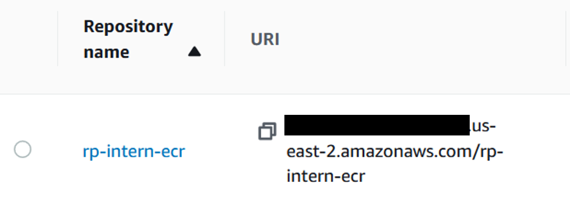


#### **5b. Tag the image**
Tag the image for the ECR repository with the following Docker command: `docker tag {name-of-image} {repostiry-URI}`.  If necessary, we can specify the version number with a colon after the URI.  For this example, we run the command `docker tag r-ecs redacted-uri-ending-with-rp-intern-ecr`.


#### **5c. Push the image**
Assuming AWS CLI is installed, push the image to ECR.
+ First, get the token so that Docker may push to AWS ECR
```
aws ecr get-login-password --region {name-of-region}
```

+ Copy this token (it'll be a long series of characters) and then connect to AWS repository
```
aws ecr --region {name-of-region} | docker login -u AWS -p {token} {repository-URI}
```

+ Push; this step might take about a minute
```
docker push {repository-URI}
```

Now check your ECR repository to confirm that the image was successfully pushed and tagged as latest version of the image.


### **6. Set up the appropriate IAM permissions between AWS services**

So far, we have uploaded (i) files to an S3 bucket and (ii) a Docker image to an ECR repository.  This step covers the pre-work necessary for a Fargate cluster to access these materials.

#### **6a. Create a policy for S3 access**
Before creating IAM Roles, we need to create a policy that grants access to our S3 bucket. 

Navigate to the **IAM** service, select **Policies** from the left-hanf menu, and then select **Create policy**.  You can create a policy in the Visual Editor tab.  Under Service, select **S3** and under Actions, check the actions that the container will perform on the S3 bucket.  For this example, you can select **Read**, **Write**, and **List**.  
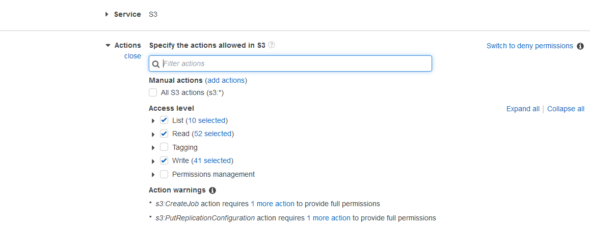

Under Resources, choose **Specific** and then **Add ARN** under Bucket.  Then enter the name of your S3 bucket (e.g.,`rp-intern-2022`) when prompted.  This grants access to the specified bucket.  Now, under Object, check the "Any" box.  This grants access to all objects within the bucket.  You can select **Add ARN** under bucket to grant access to only specific objects.


Then click **Next** and add appropriate tags.  Click **Next: Review** to review all details.  Give the policy a name; I named mine `s3-access-rp-intern-2022` and (optionally) include a description.  When ready, select **Create Policy**.

*Note: In my actual implementation, I granted full access (`s3*`) to my S3 bucket.  The full policy is listed below.*

<details>
  <summary>Full S3 access policy used (not recommended for final implementation)</summary>

```
{
    "Version": "2012-10-17",
    "Statement": [
        {
            "Effect": "Allow",
            "Action": [
                "s3:*"
            ],
            "Resource": [
                "arn:aws:s3:::rp-intern-2022",
                "arn:aws:s3:::rp-intern-2022/*"
            ]
        }
    ]
}
```
</details>


<br>


#### **6b. Create a policy for ECR access; attach to user**
We also need to create a policy that grants access to our ECR repository.  Once again, navigate to the **IAM** service, select **Policies** from the left-hanf menu, and then select **Create policy**.  Under Service, select **Elastic Container Registry** and under Actions, check **All Elastic Container Registry actions (`ecr:*`)**.  

*Note: This is the most permissive option, but for final implementation, it is recommended to grant only the fewest permissions necessary.* 

 Under Resources, add the URI to your ECR repository.
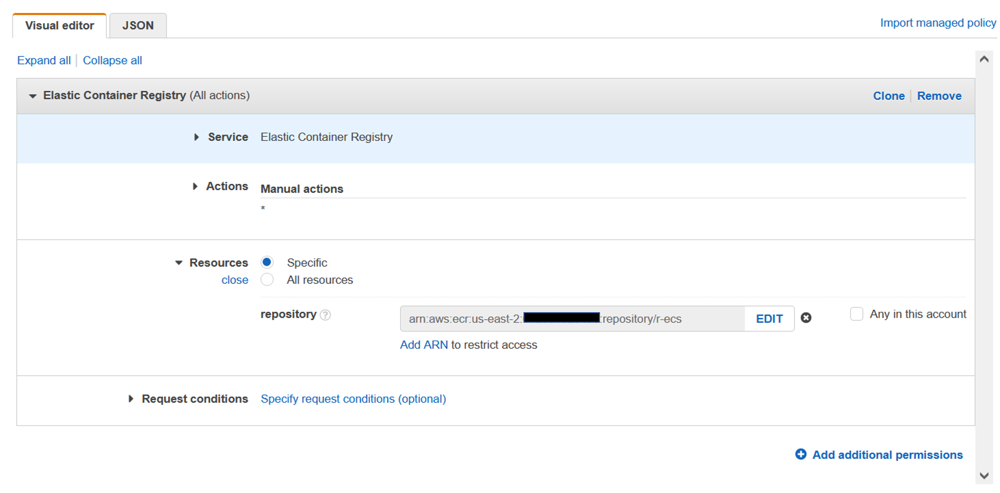

Then click **Next** and add appropriate tags.  Click **Next: Review** to review all details.  Give the policy a name (e.g., `rp-intern-ecr-policy`) and (optionally) include a description.  When ready, select **Create Policy**.

Next, we attach this ECR policy to a user (or user group or role).  To do this, navigate to the **IAM** service, select **Users** from the left-hand menu, and then select the name of the user to grant ECR repository access.  Under Permissions Policies, select **Add permissions**.  Under Grant Permissions, select **Attach existing policies directy**, search for the name of your ECR policy, and select it.  After adding the policy, select **Next: Review** and then **Add permissions**.

#### **6c. Create a Task Role**
According to the AWS page, a Task Role is an "optional IAM role that tasks can use to make API requests to authorized AWS services."  In other words, a Task Role authorizes the ECS task to access various AWS services (e.g., S3).

On the AWS console, navigate to the **IAM** service, select **Roles** from the left-hand menu, and then select **Create role**.

Under Trusted Entity type select **AWS Service** and under Use Case, select **Elastic Container Service Task**.  Then click **Next**.

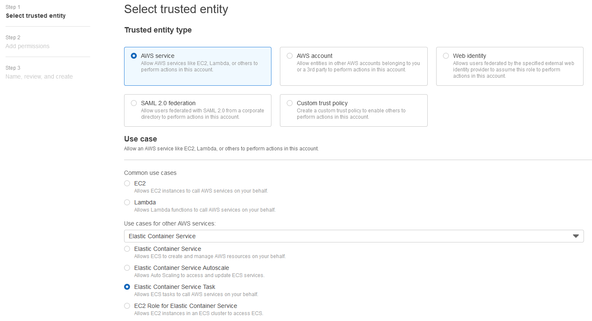

Here, we grant the Task Role access to our S3 bucket and to ECS:
+ Search for the policy created in [section 6a](#6a-create-a-policy-for-s3-access) by its given name (e.g., `s3-access-rp-intern-2022`) and select it. 
+ Search for the AWS-managed policy called **AmazonECSTaskExecutionRolePolicy** and select it.  This policy allows Fargate container agents to utilize AWS services.  Read more [here](https://docs.aws.amazon.com/AmazonECS/latest/developerguide/security-iam-awsmanpol.html). [[**revisit, may be unnecessary step**]]
+ Then click **Next**.  

Give the role an intuitive name.  I used `rp-intern-s3-ecs-task`.  The role is generated with a default description, but you may modify it.  Be sure to add tags and then click **Create role**.

#### **6d. Attach ECS Access Policy to a user**
This step grants specific users permission to use ECS.

*Note: In this implementation, I attach the policy to a specific user, but these instructions should also be roughly applicable to user groups and roles.*

On the AWS console, navigate to the **IAM** service, select **Users** from the left-hand menu, and then select the name of the user to grant ECS access.  Under Permissions Policies, select **Add permissions**.  Under Grant Permissions, select **Attach existing policies directy** and search for **AmazonECS_FullAccess**.
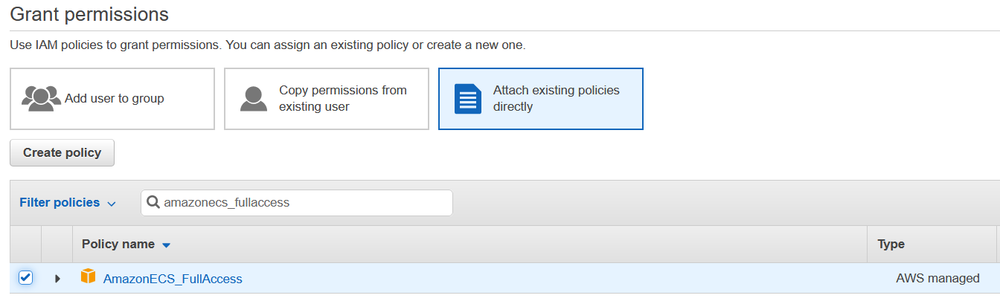 

**AmazonECS_FullAccess** is an AWS-managed policy that grants the user full access to all ECS features.  According to [AWS documentation](https://docs.aws.amazon.com/AmazonECS/latest/userguide/security-iam-awsmanpol.html): 

> "This policy grants administrative access to Amazon ECS resources and grants an IAM identity (such as a user, group, or role) access to the AWS services that Amazon ECS is integrated with to use all of Amazon ECS features. Using this policy allows access to all of Amazon ECS features that are available in the AWS Management Console."

Since this is the least restrictive policy available, it is recommended to use this policy as a base and modify permissions so that it grants the fewest privileges necessary.

After adding this policy, select **Next: Review** and then **Add permissions**.

### **7. Create an ECS Fargate cluster**
To create a Fargate cluster, navigate to **Elastic Container Service** and select **Clusters** under Amazon ECS and then select **Create Cluster**.
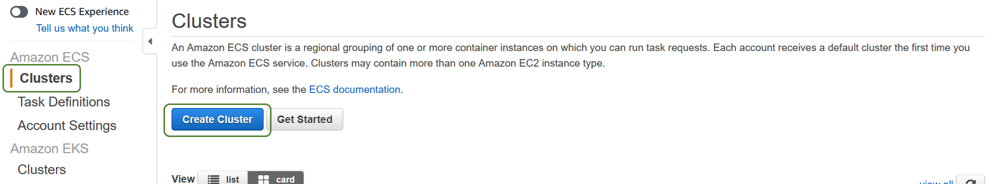

Under Select Cluster Template, choose **Networking only**.  This option is meant for Fargate tasks.  The other options, which involve EC2, require the user to specify EC2 instances.  With Fargate, however, AWS is responsible for provisioning and managing EC2 instances.  Select **Next step**.


Give the cluster a name; I chose `rp-intern-ecs-cluster`.  Under Networking, select the option to **Create a new VPC cluster**.  Add the necessary tags.  To keep track of container logs, select the option to **Enable Container Insights** on Cloudwatch.  When ready, click **Create**.
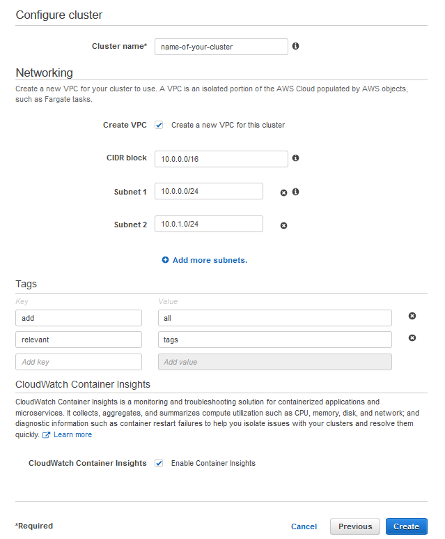

### **8. Create a Task Definition within the Fargate cluster**
 
To create a Fargate Task Definition, navigate to **Elastic Container Service** and select **Task Definitions** under Amazon ECS and then select **Create new Task Definition**.
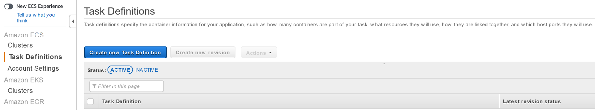

Under Launch Type Compatibility, select **Fargate**.  The click **Next**.
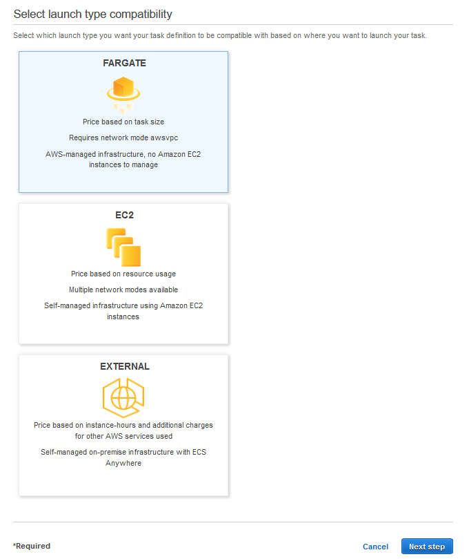

On the next page, we configure the task and container.  First, give the task an intuitive name.  Under Task Role, select the role created in [section 6c](#6c-create-a-task-role).  In this example, it is called `rp-intern-s3-ecs-task`.  For operating system family, select **Linux**.  Under Task Execution Role, select the default option (**ecsTaskExecutionRole**).  
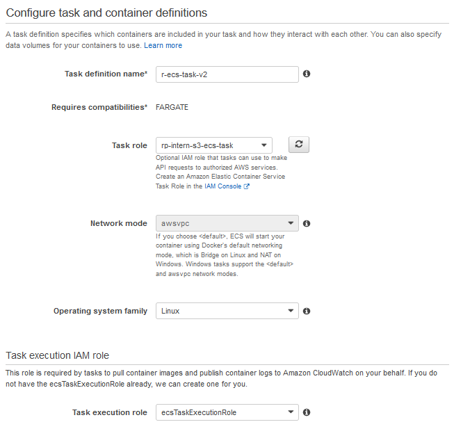

Under Task Size, I selected the lowest values available since this demonstration is a small one.  These values may need to be adjusted for larger tasks.
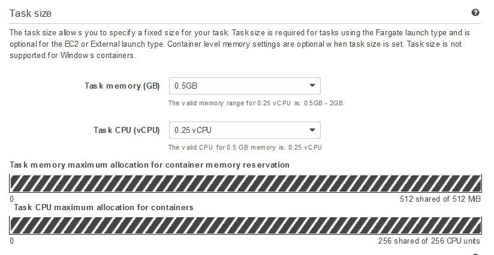

Under Container Definitions, click **Add container**.  A new page will appear.  Give the container a name; I used `r-ecs-container`.  Then add the URI to the ECR repository and make sure to include to include the image tag (e.g., "latest").  Allow the memory limit to remain at the default value of 128. 
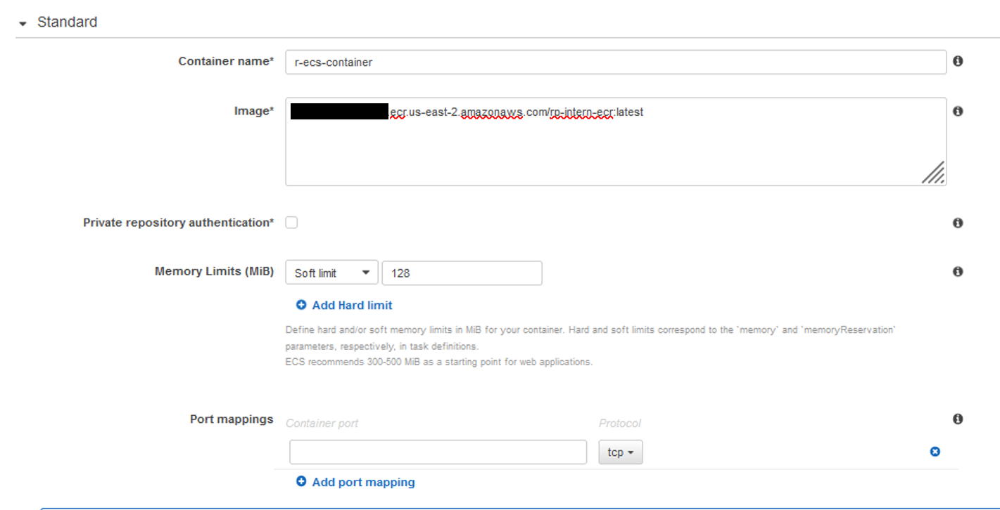

For advanced container configuration, scroll down to the **Environment** section.  We can leave these fields blank or we can define default environmental variables.  In my case, I chose to set the `SCRIPT` argument (used in the Dockerfile) to `test-script.R`.
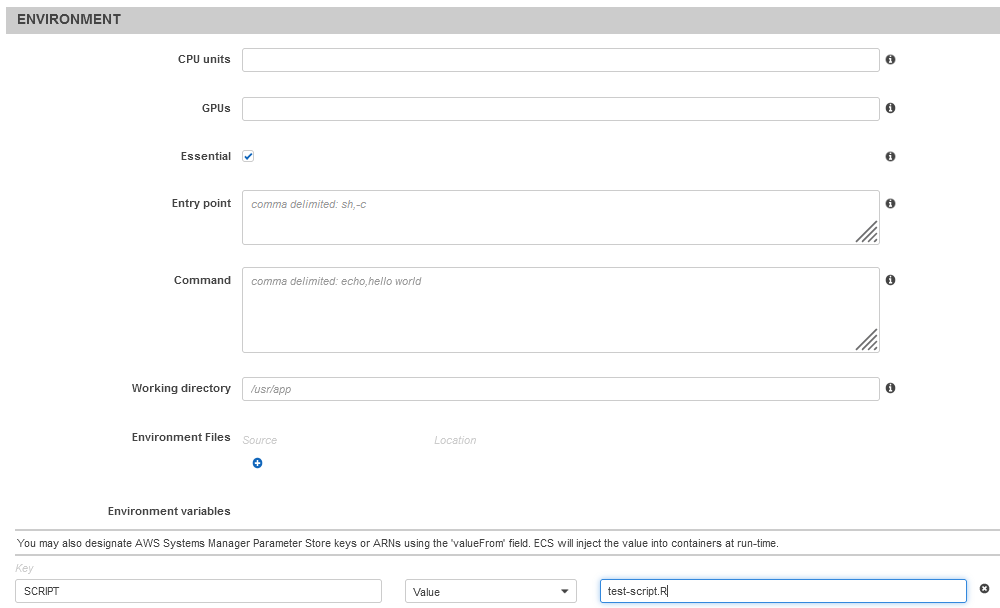

Next, scroll down to the **Storage and Logging** section.  The location listed under `aws-logsgroup` is where all log files from the container will be stored. the location on CloudWatch where all container logs will get saved (discussed further below).  When ready, click **Add**.
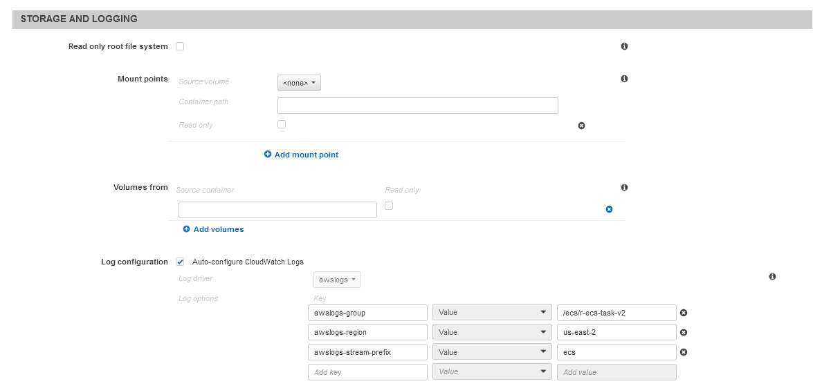

For the remaining sections, use the default configurations.  Add tags and when ready, click **Create**.

### **9. Run individual tasks**
Now that a task definition is set up within a cluster, it is time to run our first task.  Nnvigate to **Elastic Container Service** and select **Clusters** under Amazon ECS and then select the name of the cluster created in [step 7](#7-create-an-ecs-fargate-cluster).  Under the Tasks tab, click **Run new Task**.
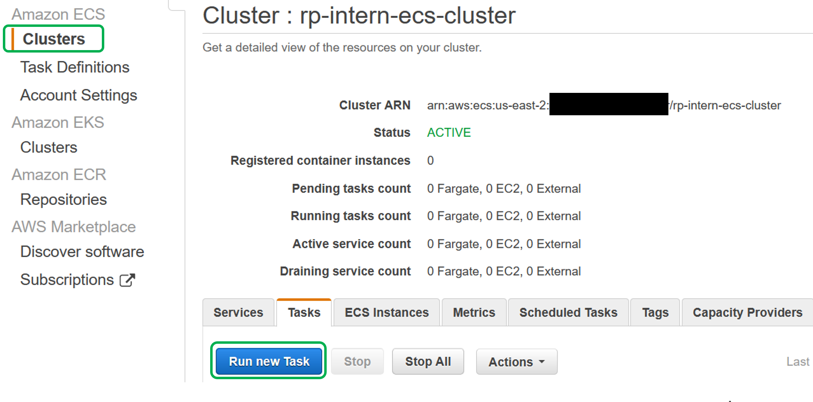

+ Under Launch Type, select **Fargate**.
+ Under operating system familty, select **Linux**.
+ Under task definition, select the name of the task definition created in [step 8](#8-create-a-task-definition-within-the-fargate-cluster) and use its latest revision.
+ Use the **LATEST** platform version
+ For cluster, select the name of the cluster created in [step 7](#7-create-an-ecs-fargate-cluster).
+ Let the number of tasks be 1 and leave the Task Group field blank.
+ Select a VPC from a dropdown list and then select one subnet.
+ For all other options, use the default values.
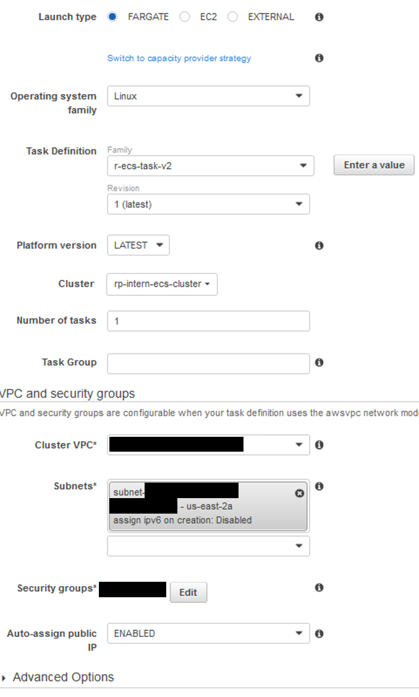

+ Scroll down to **Container Overrides**.  Here, we can specify the name of the R script to run.  The default value is `test-script.R` (from [step 8](#8-create-a-task-definition-within-the-fargate-cluster)), but we can override this to any R script saved in our S3 folder.  For this demonstration, I will run the default script.

+ Add tags
+ Click **Run task**

This will redirect back to the Tasks tab and the task we just ran will appear on the dashboard.  The status of the task will change from **PROVISIONING** to **PENDING** to **RUNNING**.  When the task finishes running, its status will change to **DEPROVISIONING** and finally, **STOPPED**.


### **10. View logs & S3 bucket**

#### **Log Streams**

To view the logs from the container, navigate to the **CloudWatch** service, select **Log groups** from the left-hand menu, and search for the log group assigned to your task (discussed in [step 8].(#8-create-a-task-definition-within-the-fargate-cluster)).
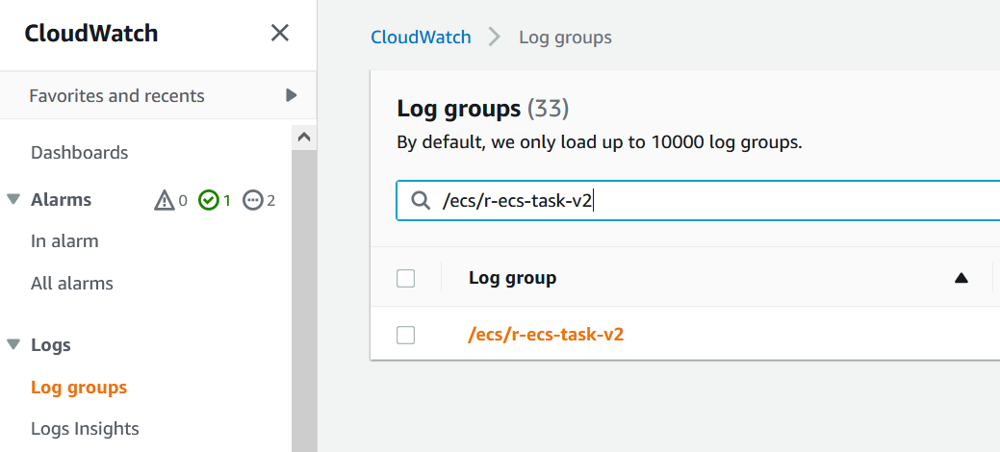

This will list the logs from all task runs as **Log streams**.  An example of a log stream is provided below.  Notice that it includes print statements from the R script and statements about S3 uploads and downloads.
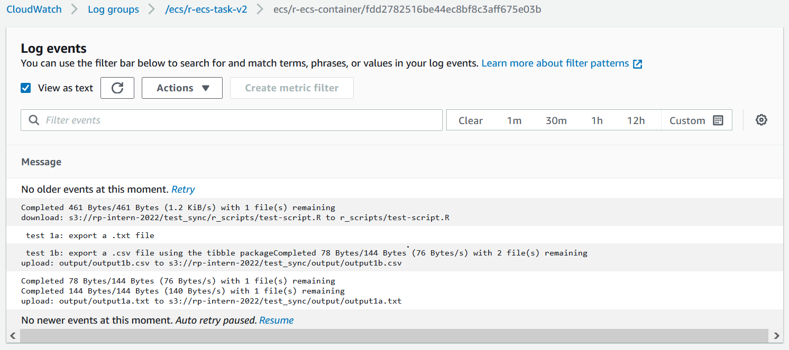

#### **S3 Bucket**
Navigate to the S3 bucket created in [step 2](#2-upload-the-r-script-to-an-s3-bucket) and check the `output/` folder.  The container should have exported new files to this location.

*Additional test: Repeat [step 9](#9-run-individual-tasks), but override the `SCRIPT` variable and set it to `test-script-2.R`.  Check the log group and the S3 bucket to make sure that the container ran as expected.*

### **11. Concluding thoughts**

This section covers (a) next steps for this module, (b) certain unresolved issues and outstanding questions, and (c) links to helpful resources.

#### **11a. Next steps**
+ Automate from command line
+ Auto-scaling

#### **11b. Outstanding issues and questions**
1. Running multiple scripts (in sequence) in a single container session
2. Tradeoff between running a step during the container build v. during container deployment:
    * Container build steps consist of commands following `RUN`, and container deployment steps consist of commands following `CMD`. 
    * In this example, we copy input files and install R packages during the container build.
        * One benefits of this is that it saves time because this step runs only once.  In other words,  every time the container is started, these files and R packages are already present in the container and ready for use.
        * One important limitation is that this approach offers limited flexibility.  When the container is started *only* the files and R packages downloaded during the build are available for use.  All other materials would have to be downloaded while the container is running.

    * The `RUN` command is used or the container deployment (`CMD`)
    * Copying input file(s).
    * Installing R packages via `requirements.R`.
        * Consider using an `renv` file.  See [here](https://www.r-bloggers.com/2021/05/best-practices-for-r-with-docker/) (#3 under Best Practices) for an example.
+ Generating detailed R logs

#### **11c. Helpful resources**
Below is a list of materials that I found helpful while preparing post.
+ Docker
     * Prakhar Srivastav, [Docker for Beginners](https://docker-curriculum.com/), *Docker Curriculum*.
     * TechWorld with Nana, [Docker Tutorial for Beginners](https://www.youtube.com/watch?v=3c-iBn73dDE), *YouTube*, October 21, 2020.
+ R for Docker
    * [The Rocker Project](https://rocker-project.org/)
    * Carl Boettiger and Dirk Eddelbuette, [An Introduction to Rocker: Docker Containers for R](https://journal.r-project.org/archive/2017/RJ-2017-065/RJ-2017-065.pdf), *The R Journal, Vol. 9, No. 2*, December 2017.
    * Elizabeth Stark, [An R-docker hello world example](https://towardsdatascience.com/an-r-docker-hello-world-example-881e771214e2), *Medium: Towards Data Science*, January 4, 2018.
+ AWS ECR
    * [Creating a container image for use on Amazon ECS]((https://docs.aws.amazon.com/AmazonECS/latest/userguide/create-container-image.html)), *AWS Documenation*.
    * Kaushal Joshi, [How to Build and Push Docker Images to AWS ECR](https://www.freecodecamp.org/news/build-and-push-docker-images-to-aws-ecr/), *Free Code Camp*, April 27, 2022.
+ AWS ECS + Fargate
    * [Lambda or Fargate for containers?](https://awsbites.com/10-lambda-or-fargate-for-containers/), *AWS Bites Podcast Episode*, November 11, 2011.
    * Jeremy Zhang, [Step by Step Guide of AWS Elastic Container Service (With Images)](https://towardsdatascience.com/step-by-step-guide-of-aws-elastic-container-service-with-images-c258078130ce), *Medium*, June 20, 2020.
    * Keilan Jackson, [Fargate vs. Lambda: Serverless in AWS](https://www.bluematador.com/blog/serverless-in-aws-lambda-vs-fargate), *Blue Matador*, June 16, 2020.
    * Cloud with Raj, [AWS Fargate Tutorial with Demo using ECR and ECS | Run Docker Container on Fargate](https://www.youtube.com/watch?v=JzsSjcyN3MI), *YouTube*, June 2, 2019.
    * Ben Bogart, [Deploying a Docker container with ECS and Fargate](https://towardsdatascience.com/deploying-a-docker-container-with-ecs-and-fargate-7b0cbc9cd608), *Medium: Towards Data Science*, July 3, 2021.